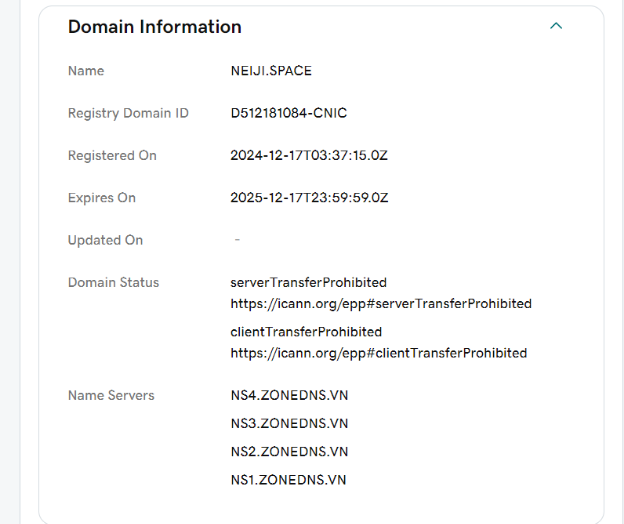
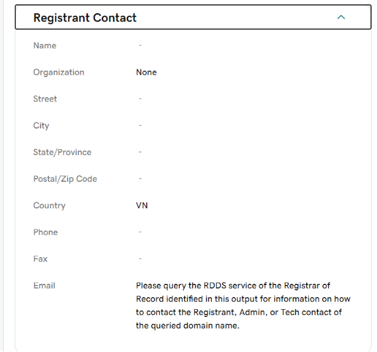
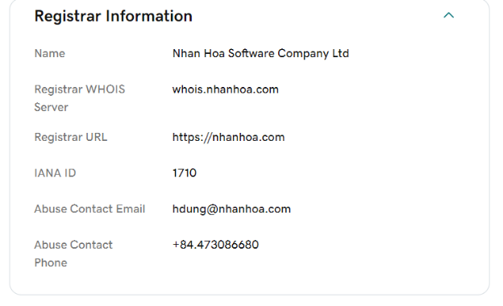
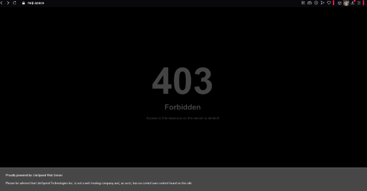
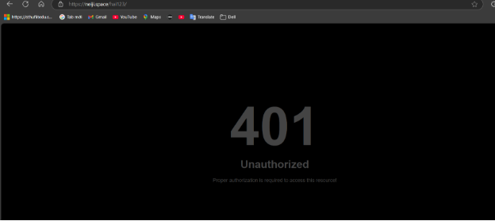

1. **Quản trị domain, kiểm tra thông tin Domain, các trạng thái của 1 domain cần có, take notes với những trạng thái bạn cho rằng ảnh hưởng tới việc truy cập 1 website.**

   

*Hình 1. Thông tin Domain*

Bao gồm tên domain là neiji.space, ID đăng ký tên miền, ngày đăng ký, ngày hết hạn, trạng thái domain và name servers. 

*Hình 2. Liên hệ nhà đăng ký*

Registrant Contact chứa các thông tin liên quan đến người đăng ký tên miền và sở hữu tên miền này, bao gồm tên, tổ chức, mã zip code khu vực và quốc gia.

*Hình 3. Thông tin nhà đăng ký*

Registrar Information là nơi hiển thị thông tin nhà cung cấp dịch vụ domain cho người sở hữu domain đó

`	`**Các trạng thái ảnh hưởng đến việc truy cập một website**

1. **403 Forbidden**

*Hình 4. Lỗi 403 Forbidden*

Lỗi 403 xảy ra khi người dùng không có quyền truy cập vào tài nguyên, sai cấu hình quyền truy cập trên máy chủ hoặc người quản trị website không cung cấp đúng đường dẫn thư mục website cho khách hàng. Liên hệ người quản trị kiểm tra lại quyền thư mục hoặc url và đưa lại url mới.

1. **401 Unauthorized**

Hình 5. Lỗi 401 Unauthorized

Lỗi 401 xảy ra khi người dùng truy cập vào một website và website yêu cầu tài khoản và mật khẩu để đăng nhập và khi người dùng nhập sai tài khoản và mật khẩu hệ thống sẽ thông báo lỗi 401 ra màn hình vấn đề này xảy ra là do người quản trị website đã set tài khoản và mật khẩu cho folder mà đang chứa source code website đó để xác thực trước khi truy cập vào website. Liên hệ người quản trị để họ cấp tài khoản và mật khẩu để truy cập vào website.

